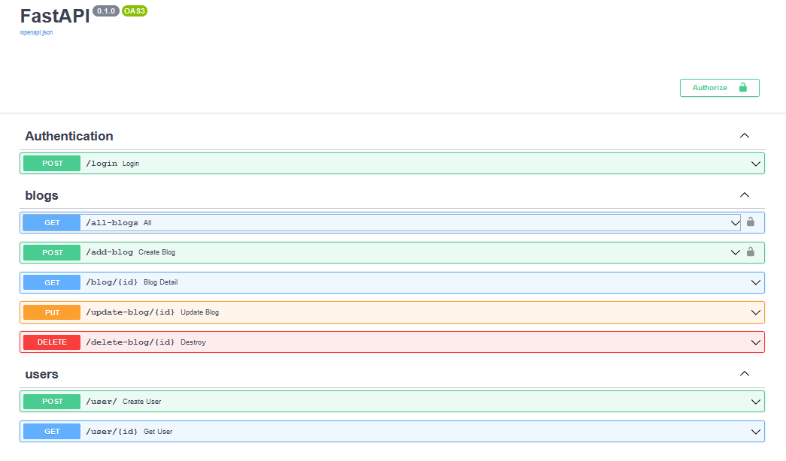

## Simple Blog APIs using fastAPI framework

1. Clone the repository
2. Create Environment
3. Activate Environment
4. Install requirements.txt (pip install -r requirements.txt)
5. Run server( uvicorn blog.main:app --reload)

